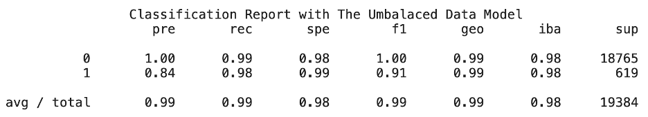

# Supervised Credit Risk Classification

## Overview of the Analysis

The goal of this analysis is to develop a robust model capable of predicting the creditworthiness of borrowers from a peer-to-peer lending platform, and understand the main drivers of default. The model is designed to accurately differentiate between healthy loans and high-risk loans, allowing the company to minimize losses from defaulted loans while maximizing profitability by approving creditworthy borrowers. 

The data used in this analysis consists of historical loan records and key financial indicators that reflect the borrower's financial standing and loan attributes. These features include loan size, interest rate, borrower income, debt-to-income ratio, number of credit accounts, total debt, and the presence of derogatory marks. 

The dataset includes 77,536 loan records, of which 75,036 are categorized as healthy loans, while 2,500 represent defaulted (high-risk) loans. As expected, the data is imbalanced, with a small proportion of high-risk loans, which mirrors real-world scenarios where the majority of borrowers meet their financial obligations. Advanced machine learning techniques and strategies to handle imbalanced data have been applied to mitigate this limitation.

### Overview of Results
We developed and evaluated two Logistic Regression models to predict loan quality. **Model 1** was trained on the original, imbalanced dataset, while **Model 2** incorporated oversampling techniques to address the class imbalance. Model 2 achived an Imbalanced Binary Accuracy of 99%, above the 98% mark of model 1.

The features that more contributed to determine risk are debt-to-income-ratio, derogatory marks, and loan size.

---

## Stages of the Machine Learning Process

The process involved in machine learning modelling consist of the following steps:

1. **Collection and preparation of the data.** This was done prior to this analysis, and the data is available this [csv file]("Resources/lending_data.csv"). An overview of the initial dataset is shown below.

2. **Definition of training and test data.** We split the data into **training** and **testing** data sets, by applying the [`train_test_split`](https://scikit-learn.org/stable/modules/generated/sklearn.model_selection.train_test_split.html) function from the Model Selection module of the SciKit-learn library in Python. The **training data** is used to fit the model, and the **test data** (25% of the total set) is used to evaluate the model's predictive performance. 

3. **Creation of potencial models for evaluation.** We create two Logistic Regression models using the [`LogisticRegression`](https://scikit-learn.org/stable/modules/generated/sklearn.linear_model.LogisticRegression.html#sklearn.linear_model.LogisticRegression) method from the Scikit-learn's Linear Model module:
    - **Machine Learning Model 1**: this model directly uses the original loan data. 
    - **Machine Learning Model 2**: this model improves upon Model 1 by applying **oversampling** to address the imbalance between high-risk and healthy loans in the dataset. We used the [`RandomOverSampler`](https://imbalanced-learn.org/stable/references/generated/imblearn.over_sampling.RandomOverSampler.html#imblearn.over_sampling.RandomOverSampler) method, from the `Imblearn` library, by randomly select defaulted loans (with replacement), to equalize the number of observations in both classes. The resulting class distribution is shown below.

4. **Normalize the data.** We use z-scores, so each feature has a mean of 0 and a standard deviation of 1. This step is important because it scales the variables to a comparable range, preventing features with larger magnitudes from disproportionately influencing the model’s coefficients. 

5. **Fitting of the model.** We fit the **training data** to each model using the [`fit` method](https://scikit-learn.org/stable/modules/generated/sklearn.linear_model.LogisticRegression.html?highlight=fit#sklearn.linear_model.LogisticRegression.fit) of the Logistic Regression model. We use the default values, which are Limited-memory Broyden–Fletcher–Goldfarb–Shanno (LBFGS) for the optimization solver, and ** L2 regularization** to prevent overfitting to the training data, particularly reducing the impact of less important features.

6. **Predicting the quality of the loans** (healthy or high-risk) on the *test sample data* for both models. We used the [`predict` method](https://scikit-learn.org/stable/modules/generated/sklearn.linear_model.LogisticRegression.html?highlight=fit#sklearn.linear_model.LogisticRegression.predict) of the LogisticRegression model to generate this predictions. 

7. **Comparison of results.** The following key metrics were used to evaluate model performance:
    - [balance accuracy score](https://scikit-learn.org/stable/modules/generated/sklearn.metrics.balanced_accuracy_score.html)
    - [precision score](https://scikit-learn.org/stable/modules/generated/sklearn.metrics.precision_score.html)
    - [recall score](https://scikit-learn.org/stable/modules/generated/sklearn.metrics.recall_score.html). 

    > The **precision score** measures how accurately the model predicts a specific class. For example, out of loans predicted to be high-risk, what percentage were actually high-risk loans. 

    > The **recall score** imeasures how well the model identifies a particular class. For instance, out of all actual high-risk loans, what percentage the model correctly classifies as high-risk. 

    > The **Imbalanced Binary Accuracy (IBA)** designed to handle imbalanced datasets by incorporating both accuracy and the geometric mean of sensitivity (recall for the minority class) and specificity (recall for the majority class), allowing for a more balanced evaluation of classification performance.
   

8. **Feature Importance.** Lastly, we use SHAP analysis to identify the most influential features contributing to the model's assessment of loan health. We do this for the overall data, and individual cases.

---

## Moodel Evaluation

Here are the classification reports of both models.

The key metrics described earlier - **IBA**, **precision**, and **recall**— are summarized for each model below.

### **Machine Learning Model 1 metrics:**
- **IBA:** 98%
- **Precision score:** 
    - Healthy loans: 100%
    - High-risk loans: 84%
- **Recall score:**
    - Healthy loans: 99%
    - High-risk loans: 98%

### **Machine Learning Model 2 metrics:**
- **Balance Accuracy score:** 99%
- **Precision score: **
    - Healthy loans: 100%
    - High-risk loans: 83%
- **Recall scores:**
    - Healthy loans: 99% 
    - High-risk loans: 99%

---

## Feature Importance

Here are the results provided by the SHAP feature importance on the overall data (see plot below):

- The feature `debt_to_income_ratio` emerges as the most significant determinant in the model's assessment of loan performance.
- `derogatory_marks`, followed closely by `loan_size`, rank as the second most important features influencing the prediction.
- Features such as `total_debt`, `borrower_income`, and `interest_rate` play a comparatively smaller role overall, but they may become important in specific cases. These features can capture nuances in the borrower’s financial situation and provide more granular insights when the more dominant features do not fully explain the risk profile.
- Lastly, number_of_accounts holds the least importance among all features, though it still contributes some value to the model's decision-making.

Below there is a plot for the feature contribution analysis of a high-risk **individual** loan prediction. Look for in deph analysis in the [credit_risk_resampling](credit_risk_resampling.ipynb) notebook. 

A small extract to understanding feature contributions for this individual case:

** Features that Increase Risk**.
- **High Debt-to-Income Ratio (SHAP Value = 11.45):**

Starting from the base value of -6.74, the debt-to-income ratio pushes the prediction strongly toward high risk by itself. The positive SHAP value of 11.45 is a huge shift, indicating that a high debt-to-income ratio is a the main risk factor. This suggests the borrower is likely to struggle with repayment, and the model heavily penalizes such scenarios.

- **Large Loan Size (SHAP Value = 6.51):**

Similarly, the large loan size (4+ standard deviations above average) pushes the prediction even further toward high risk, with a substantial SHAP value of 6.51. This is a dominant factor that almoves the prediction from low risk to high risk when considered alongside the debt-to-income ratio.

---

## Conclusions:

* The **IBA** shows an improvement from 98% in Model 1 to 99% in Model 2 when applying oversampling. This improvement is primarily due to same increase in the recall for hig-risk loans.

The incremental benefit of applying imbalance is:
 - Correct identification of additional 6 high-risk loans
 - Correct identification of additional 6 healthy loans
 - Missclassification of 15 healthy loans as highly risky
 
If we assumed that the benefit of preventing taking a bad loan is larger than the opportunity cost of not taking a good loan, then we prefer using the model with the imbalance treatment, which is slighly better overall than the regular logistic model. However, any of both models are highly accurate.

The features that more contributed to determine risk are debt-to-income-ratio, derogatory marks, and loan size. The other features has significantly less importance, but none has zero contribution.

---

## Coming improvements

Since the performance of both models are pretty close, we will execute cross validation for the definitive selection of the best moodel.

----

## Technologies Used

This project is developed in **Python** using **JupyterLab** as the interactive environment. The analysis relies heavily on the `Scikit-learn (SkLearn)` library, particularly the following modules:
- `metrics` for performance evaluation
- `preprocessing` for data preparation
- `model_selection` for splitting data and cross-validation
- `linear_model` for model development

Additional libraries used include:
- `NumPy` for numerical computations
- `Pandas` for data manipulation and analysis
- `Pathlib` for file handling
- `Warnings` to manage warning messages in the code

--- 

## Installation Guide

The project is provided as a Jupyter notebook. If you do not have Jupyter installed, you can follow the installation instructions [here](https://jupyterlab.readthedocs.io/en/stable/getting_started/installation.html).

Once Jupyter is installed, you can run the notebook by launching JupyterLab or Jupyter Notebook from your terminal.

--- 

## Contributors

This project was created by **Paola Carvajal Almeida**.

Feel free to reach out via email: [paola.antonieta@gmail.com](mailto:paola.antonieta@gmail.com)

You can also view my LinkedIn profile [here](https://www.linkedin.com/in/paolacarvajal/).

--- 

## License

This project is licensed under the **MIT License**. This license permits the use, modification, and distribution of the code, provided that the original copyright and license notice are retained in derivative works. The license does not include a patent grant and absolves the author of any liability arising from the use of the code.

For more details, you can review the full license text in the project repository.

